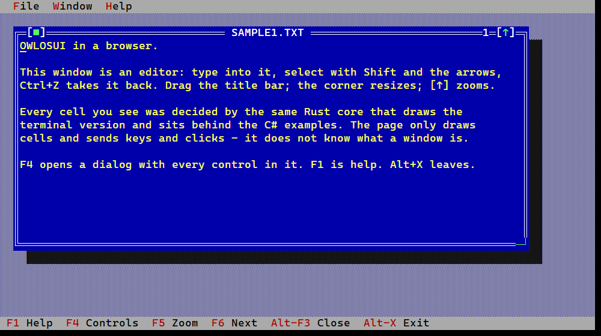

# OWLOSUI

A Turbo Vision-shaped text mode UI toolkit with one portable core.

One core draws the same windows on a terminal, in a native Windows window,
in a browser and on DOS. Nothing above the platform layer knows which of
those it is running on, and a program in any language can use it without
linking to it.

| A native Windows window | A browser | DOS |
|---|---|---|
|  |  |  |

## Where to start

The toolkit is in [lib/](lib/README.md). Everything that uses it is in
[Examples/](Examples/README.md), by where it runs and then by language:

* **Desktop** - [Examples/Desktop](Examples/Desktop/README.md). C#: `dotnet
  run` in [Examples/Desktop/CSharp/01-HelloWorld](Examples/Desktop/CSharp/01-HelloWorld/Program.cs),
  six steps up to the full demo in a window of its own. Rust: `cargo run -p
  owlosui-demo` on the terminal, `cargo run -p owlosui-win` in a window.
* **Web** - [Examples/Web](Examples/Web/README.md). `Examples\Web\RUN.CMD`
  builds the core for the browser, serves it and opens the demo; five
  JavaScript steps mirror the C# ones.
* **DOS** - [Examples/DOS](Examples/DOS/README.md). The same demo in
  assembler, C and Pascal, each drawing through OWLOSRES - the toolkit
  behind INT 60h - and the Rust application as a DOS program of its own.
  `Examples\DOS\Asm\RUNWIN.BAT DEMO` shows it in DOSBox-X.
* **Speak the wire** - [lib/PROTOCOL.md](lib/PROTOCOL.md): every request, its
  bytes and its reply. The C# and JavaScript clients are two implementations
  of it.
* **Write a screen** - the contract is below, and the ones that exist are
  short: [the terminal](lib/console/src/term.rs),
  [the Windows window](lib/window/src/lib.rs),
  [the canvas](lib/js/owlosui.js),
  [DOS](lib/dos/src/lib.rs).

## The contract

Three things cross the line between the core and a backend, and nothing else:

* events go **in** — `Event::Key`, `Event::Mouse`, `Event::Resize`, `Event::Tick`
* a grid of cells comes **out** — `Buffer`, two bytes per cell
* the backend decides how to show it

A cell is a glyph index plus an IBM PC attribute byte: low nibble foreground,
high nibble background, sixteen colours. On DOS a row of those goes to the
video hardware with no conversion at all. Everywhere else the backend
translates — and the backend is the only thing that needs to.

## Layout

```
lib/                  the toolkit
    core/             no dependencies, ever. Cell grid, view tree, event dispatch.
    console/          the terminal screen, the code pages; owlosui-match, which
                      checks scenes against real Turbo Vision
    window/           the Windows window screen: CreateWindow and GDI
    serve/            the core behind a pipe, speaking PROTOCOL.md
    csharp/           the C# client of that pipe, the core carried inside it
    js/               the JavaScript client, and the core as WebAssembly for it
    dos/              OWLOSRES, the core behind INT 60h; its bindings for
                      assembler, C and Pascal; the DOS machine layer
    PROTOCOL.md       the wire. Same numbers for a pipe, a module, an interrupt.

Examples/             everything that uses it
    Desktop/CSharp    six steps from HelloWorld to the demo in a window, and Tests
    Desktop/Rust      01-Terminal, 02-Window
    Web/RUN.CMD       build, serve, open the demo
    Web/JavaScript    five steps from HelloWorld to the demo, and test.mjs
    Web/Rust          01-Linked: the core and the application in one module
    DOS/Asm, DOS/C, DOS/Pascal
                      HELLO and the demo, the same in each, through the resident
    DOS/Rust          HELLO and the demo with the core linked in, and the shared
                      application: flat binaries under DPMI
    shared/app.rs     the one Rust application the window, the web and DOS draw
```

## A program

The whole of HelloWorld, in C#:

```csharp
using var owl = new Owlosui();

var w = owl.Window("Hello", 40, 9, style: Owlosui.Style.Dialog);
owl.Static(w, 2, 1, "Hello, world!");
owl.Buttons(w, ("~O~K", CmOk));

owl.Run(cmd => cmd != CmOk);
```

`Owlosui` starts `owlosui-serve`, sends it what happened, asks for the frame
and puts the cells on the console - or, after `owl.OpenWindow()`, lets the
server show them in a window of its own. The Rust core decides what every
cell looks like; the C# program never sees a keystroke of the editor and
never draws a line of a frame. The JavaScript version is the same calls on
a canvas.

Because the output medium *is* a grid of characters, a rendered screen is its
own screenshot. That makes the tests readable pictures (`lib/core/tests/`),
and it is what lets a program - or a model - check a layout without vision.

## Glyphs, code pages and Unicode

The core never sees Unicode. A cell is a glyph index; a title is a string
of glyph indices; an editor line is a `Vec<Glyph>` — the screen of a DOS
machine, where a number in video memory *is* the picture. One type alias
decides how big that number is:

```
cargo build -p owlosui-core --features dos    # Glyph = u8:  the byte in B800
cargo build -p owlosui-core                    # Glyph = u16: a font that grows
```

Nothing else in the core changes between the two, and the tests pass in
both. The frames, shades and arrows live below 256 in either, so they are
drawn by the same numbers on a DOS card and on a Windows console.

What a glyph *looks like* is the **font**, in one place:
`lib/console/src/codepage.rs`. It starts as a code page — 437 (the IBM
PC's) or 866 (Cyrillic, same frames at the same places) — and is either
*fixed* at those 256 (the DOS build, and the terminal backend, which draws
for one console) or *growing*: every character it has never seen gets the
next index, so a Windows or browser client shows Russian and Slovak on one
screen, as Far does, while the same program on DOS shows what its page
has and `?` for the rest. The server's font grows. Text crosses the wire as
UTF-8, becomes glyph indices there and text again on the way out;
`GET_GLYPHS` gives a client the table and every `FRAME` says how long it
is now, so the client fetches it again only when a frame reaches past what
it holds. `Owlosui.Fits(text)` still answers the DOS question — on a fixed
font, "will this show or turn to `?`" — and Notes opens a file it cannot
show read-only rather than save `?`s back into it.

The page to start from: `new Owlosui(codePage: 866)`, or
`OWLOSUI_CODEPAGE=866` in the environment, or the system's own OEM page
when it is one we have; the terminal demo reads the same variable.

## Checking against the real thing

Several scenes exist twice: here, and in `TOOLS/REFGEN/REFGEN.PAS` in the
wire-city repository, where they are built with the actual Borland Turbo
Vision units and dumped straight out of video memory. Then:

```
cargo run -p owlosui-console --bin owlosui-match -- one-window path/to/REF01.BIN --rows 1:23
```

renders the scene here and reports which cells disagree — grouped by the
*kind* of difference, because forty cells wrong in the same way are one
mistake, not forty.

The reference dumps are not committed: they are the output of commercial
units. What is committed is what they taught us, as constants with the
measurement noted beside them.

This closed the argument the project had been having with screenshots. Three
of the four scenes now match byte for byte, and the differences it found were
ones nobody could have seen: the status-line keys were bright red instead of
red, an inactive window's *background* is a different colour from an active
one's, and the yellow everybody remembers is the editor's text and not the
window's fill.

## Rules this project keeps

* **Colour comes from the palette by role, never from the element.** An element
  says what it is; the palette says what colour that is. This is the first rule
  people will want to break and the one that keeps an application coherent.
* **Whatever DOS cannot do does not exist anywhere.** The constraint is the
  design. A backend may degrade (an external link opens a tab in a browser and
  prints a URL on DOS) but may never be richer.
* **Font and code page are swappable assets.** The core emits glyph *indices*;
  CP437 is a default, not an assumption. A Cyrillic CP866 or a home computer
  character set is another file, not another code path.
* **The defaults are already right.** Construct a thing and it looks correct —
  centred, framed, navigable. Coordinates are an override, not a starting
  point.
* **Keys are a table, not code.** The core exposes primitives (`toggle_zoom`,
  `cycle_windows`, `close`); which key invokes which belongs to the
  application. Borland shipped four keymaps for one editor this way.
* **No callbacks out of the core.** Results are collected — `take_pressed`,
  `take_command`, `pending` — never delivered. That is what lets the same
  core sit behind a pipe, an interrupt or a WebAssembly boundary unchanged.

## Editing

The editor holds no key codes. It knows commands with names — `WordRight`,
`DeleteLine` — and a table turns keys into them. That is how Borland shipped
four arrangements for one editor; here there are two, `Keymap::Classic` (the
WordStar control diamond) and `Keymap::Modern` (Ctrl+C/V/Z), with the CUA
clipboard keys in both because Ctrl+C is taken by the signal in a terminal.

Every change to the text is one operation — a span replaced by some lines — so
undo is written once and is already right for commands that do not exist yet.

Because the commands have names, a test can be a script:

```text
text    one\ntwo
keys    <Down><Home><BS>
expect  onetwo
cursor  0 3
```

Those live in `lib/core/tests/scripts`, and a failure prints the script line,
what it got and what it wanted.

## Help

A small HTML viewer: links, headings, `<b>`, paragraphs, rules, lists,
`<pre>`. No tables, no images, no CSS — and no `<i>`, because a character cell
cannot be slanted and whatever DOS cannot do does not exist anywhere.

The view cannot open a file and does not try. Following a link puts the href
in `pending`; resolving it belongs to the application.

## Status

Working: desktop, overlapping framed windows (move, resize, zoom, close,
z-order, modal, following the desktop when it resizes), scrolling text
views with working scrollbars, editing with undo, selection and a
clipboard, two keymaps, a help viewer, menu bar with panels, submenus and
ticked items, a status line that shows its keys and binds them, a file-open
dialog with a path/mask line, a hex viewer, buttons (docked rows and
placed ones, so a keypad is buttons too; normal, accent and danger
colours), labels with hotkeys,
input lines, check boxes and radio buttons, lists with Insert-marks, trees,
static text, a progress bar, a message box, a canvas of cells the program
draws itself (a game board, a chart); four backends - the terminal, a
native Windows window, a browser canvas and DOS; the pipe server, its C#
client (published as one .exe with the core inside, on a console or in a
window) and its JavaScript client (the server as WebAssembly); the
resident, the same server behind INT 60h on DOS, with clients in
assembler, C and Pascal; comparison against real Turbo Vision.

Also there, as Turbo Vision had them: numbered windows and Alt+1..9,
the window list on Alt+0, Shift+F6, Ctrl+F5 to move or resize from the
keyboard, cascade and tile, double clicks, a hint per menu item on the
status line, input-line history, a colour dialog over the palette, a tree
filled as it opens (a drive as folders, with a drive chooser, in the
Commander), and find/replace in the editor.

Not yet at all: a grid, tabs, a drop-down list, a masked field, an ANSI
viewer; a resident that stays after its program ends, so several DOS
programs can share one.

## Licence

MIT OR Apache-2.0. Nothing here is derived from Borland's or Free Vision's
source; the design is reconstructed from published documentation and from the
behaviour of the original programs.
